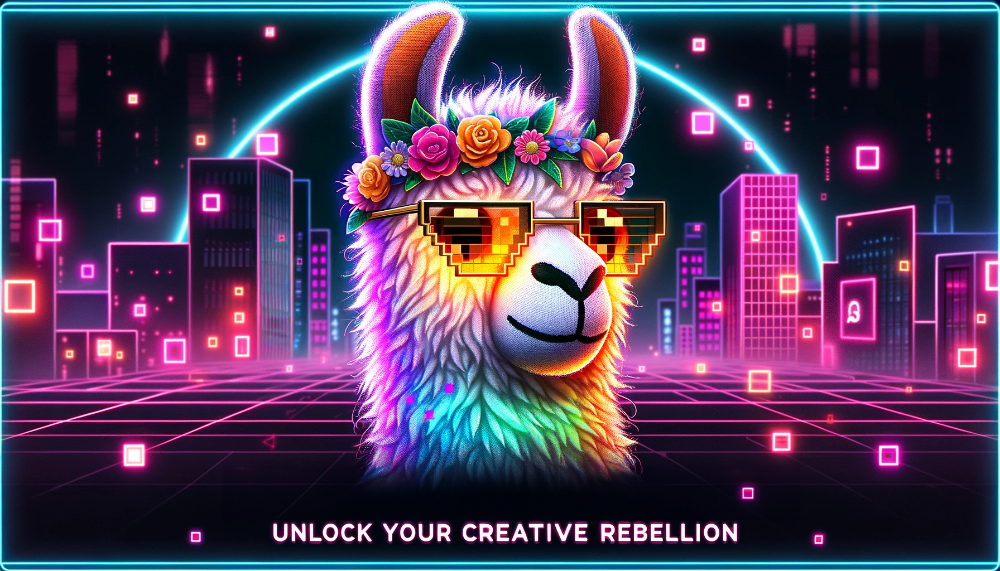

Early on in my career, I vowed to only create products that would have a positive, real-world impact on people's daily lives. I immersed myself in the realm of Training and Simulation, which provided me with the unique opportunity to be among the pioneering developers working on the HoloLens platform, exploring the limitless possibilities of augmented and virtual reality { AR / MR / XR / VR } aka spatial computing. I initiated the highly influential Microsoft [Mixed Reality Toolkit](https://github.com/microsoft/MixedRealityToolkit-Unity) (MRTK), sparking the development of a robust framework that serves as the foundation for thousands of cross-platform XR applications globally.

As a thought leader in the XR industry, my contributions have played a crucial role in driving significant advancements in mixed reality. I've had a notable impact across various market sectors, including defense, architectural visualization, training and simulation, healthcare, and entertainment. I am recognized for my ability to seamlessly integrate cutting-edge emerging technologies with user-centric design, showcasing a profound commitment to both the art of design and the science of technology. I continue to actively develop and maintain numerous open-source libraries for Unity on GitHub, with a focus on [generative AI](https://github.com/orgs/RageAgainstThePixel/repositories?q=ai+sort%3Astars) and [build automation](https://github.com/marketplace?query=buildalon).

Motivated by a desire to create opportunities rather than simply seeking them, I approach challenges with a mindset focused on success; a word I define as "***helping others be successful***".

